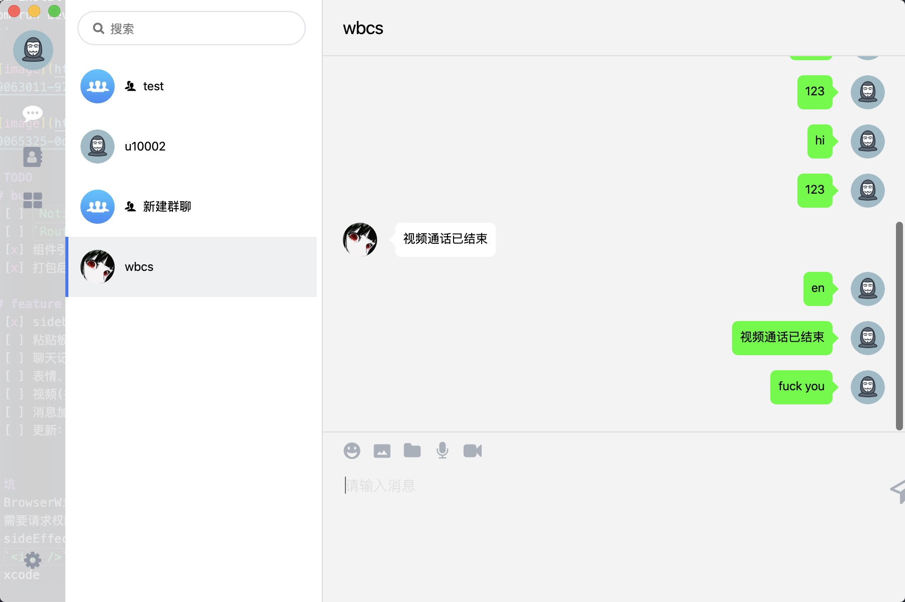
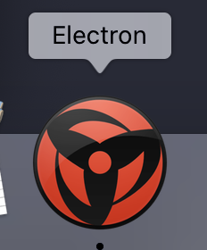

毕设前端

# get start
```sh
npm install
npm run dev
```





# TODO
## bug
+ [ ] `Notification` 重复
+ [ ] `Router` 有时不跳转
+ [x] 组件引用报错
+ [x] 打包后图片加载失败

## feature
+ [x] sidebar resize
+ [ ] 粘贴板图片问题
+ [ ] 聊天记录懒加载
+ [ ] 表情、语音、文件发送
+ [ ] 视频(打算单独整成一个组件，发布出去)
+ [ ] 消息加密解密
+ [ ] 更新：思路是 `app.asar`


# 坑
+ BrowserWindow在loadURL的时候，url如果是hash模式会报错
+ 需要请求权限的操作，在vscode的zsh里没权限导致失败
+ sideEffects为false时，会将css、less忽略，shaking掉，解决：`sideEffects: ["*.css", "*.less"]`
+ `` 来引用图片打包后总是有问题，目前采用css引入，绕开这一错误
+ xcode

# fork from 
https://github.com/percy507/hola

渲染逻辑大部分架子、主体(60%)都是hola（我懒得再写一遍交互了，，没意思）

个人完成：
+ main进程
+ scripts 开发环境、打包等script用webpack自己搭的，原来的太搓了
+ 依赖清理：无用的依赖都干掉了
+ 更新chromium内核到最新版
+ 然后各种优化：代码风格、组件拆分、UI、交互等等
